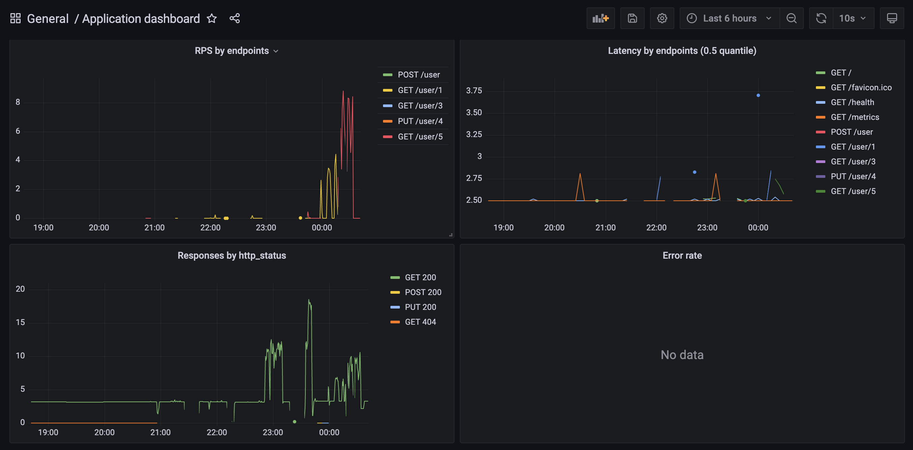
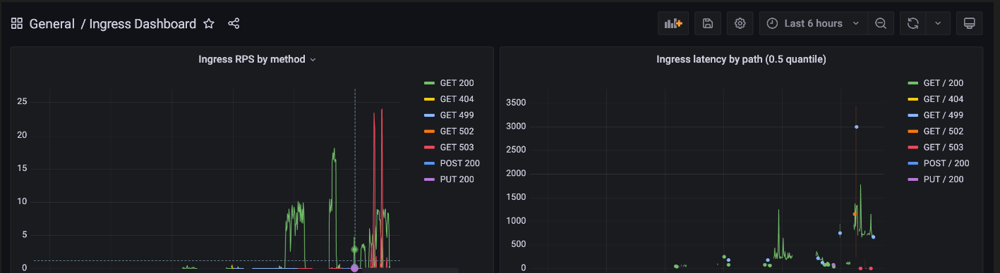
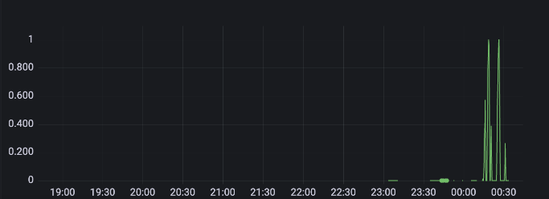
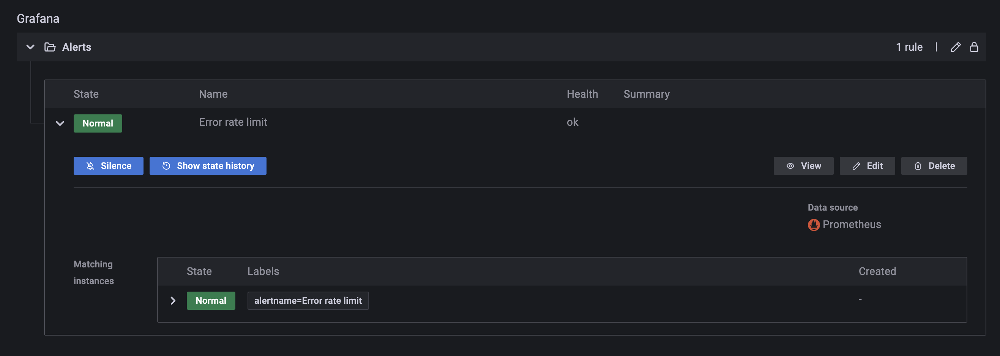

## Домашнее задание №4

Инструментировать сервис из прошлого задания метриками в формате Prometheus с помощью библиотеки для вашего фреймворка и ЯП.

На выходе должно быть:
- Скриншоты дашборды с графиками в момент стресс-тестирования сервиса. Например, после 5-10 минут нагрузки.
- json-дашборды.

Сделать дашборд в Графане, в котором были бы метрики с разбивкой по API методам:

- Latency (response time) с квантилями по 0.5, 0.95, 0.99, max
- RPS
- Error Rate - количество 500ых ответов

---

Добавить в дашборд графики с метрикам в целом по сервису, взятые с nginx-ingress-controller:

- Latency (response time) с квантилями по 0.5, 0.95, 0.99, max
- RPS
- Error Rate - количество 500ых ответов

--- 

Настроить алертинг в графане на Error Rate и Latency.

Задание со звездочкой (+5 баллов)

Используя существующие системные метрики из кубернетеса, добавить на дашборд графики с метриками:

- Потребление подами приложения памяти
- Потребление подами приолжения CPU

Инструментировать базу данных с помощью экспортера для prometheus для этой БД.
Добавить в общий дашборд графики с метриками работы БД. (пока не сделано)

