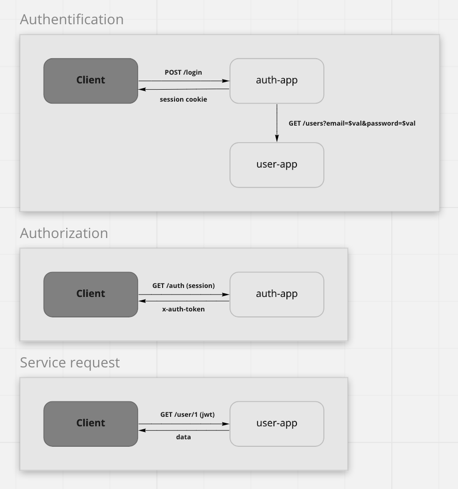

## Предварительные условия

- Kubernetes
- Helm
- Nginx Ingress
- Docker

## Установка

Установка сервиса авторизации

```shell
cd auth-app
helm install otus-hw05-auth-app .helm
```

Установка пользовательского сервиса

```shell
cd user-app
helm install otus-hw05-user-app .helm
```

### Ingress setup

```shell
cd api-gateway
kubectl apply -f nginx-ingress/ingress.yaml
```

### Traefik setup

```shell
cd api-gateway
...
```

### Forward-Auth
```shell
kubectl apply -f nginx-ingress/auth.yaml
```

Service communation schema



Run Postman test scenario

```shell
bash .postman-test.sh
```
